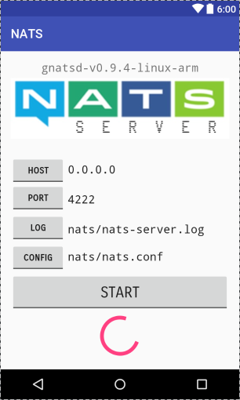

## nats-android

Android version of the NATS (http://nats.io/) Server gnatds (https://github.com/nats-io/gnatsd) 

#

Based on gnatsd v0.9.4-linux-arm

## Quickstart 

Simple Android UI to start and configure gnatsd.

A click on each of the buttons will enable the specific setting. 
The setting will override the NATS Server default settings.

- HOST                  Bind to HOST address (default: 0.0.0.0)
- PORT                  Use PORT for clients (default: 4222)
- LOG                   File to redirect log output
- CONFIG                Configuration File

LOG requires WRITE_EXTERNAL_STORAGE permissions, CONFIG requires READ_EXTERNAL_STORAGE permissions. 

- START                 Starts the NATS Server
- STOP                  Stops the NATS server

## License

(The MIT License)

Copyright (c) 2012-2016 Apcera Inc.

Permission is hereby granted, free of charge, to any person obtaining a copy
of this software and associated documentation files (the "Software"), to
deal in the Software without restriction, including without limitation the
rights to use, copy, modify, merge, publish, distribute, sublicense, and/or
sell copies of the Software, and to permit persons to whom the Software is
furnished to do so, subject to the following conditions:

The above copyright notice and this permission notice shall be included in
all copies or substantial portions of the Software.

THE SOFTWARE IS PROVIDED "AS IS", WITHOUT WARRANTY OF ANY KIND, EXPRESS OR
IMPLIED, INCLUDING BUT NOT LIMITED TO THE WARRANTIES OF MERCHANTABILITY,
FITNESS FOR A PARTICULAR PURPOSE AND NONINFRINGEMENT. IN NO EVENT SHALL THE
AUTHORS OR COPYRIGHT HOLDERS BE LIABLE FOR ANY CLAIM, DAMAGES OR OTHER
LIABILITY, WHETHER IN AN ACTION OF CONTRACT, TORT OR OTHERWISE, ARISING
FROM, OUT OF OR IN CONNECTION WITH THE SOFTWARE OR THE USE OR OTHER DEALINGS
IN THE SOFTWARE.

[License-Url]: http://opensource.org/licenses/MIT
